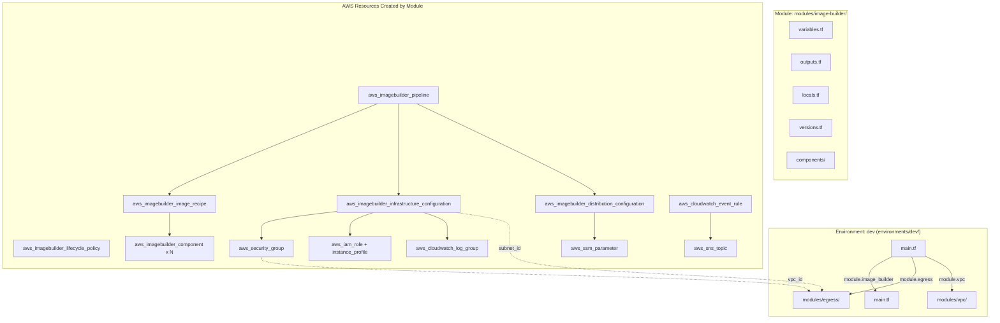
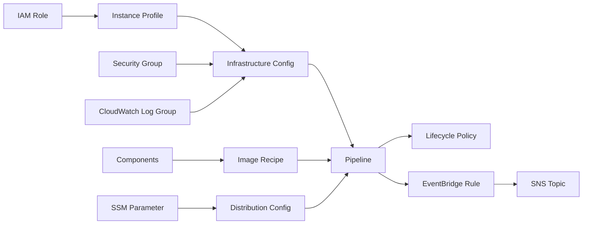
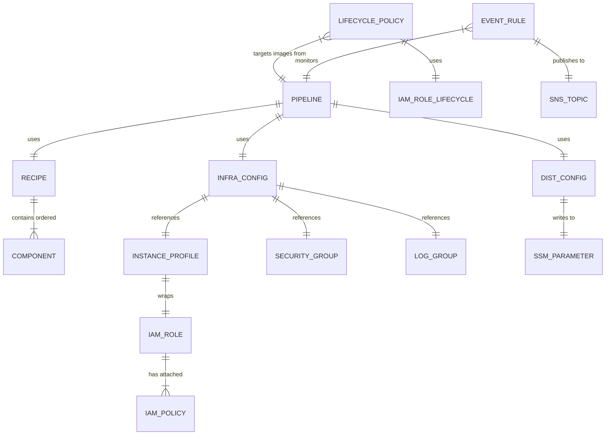

# Design Document: AMI Image Builder

## Overview

This design specifies a Terraform module (`modules/image-builder/`) that provisions an EC2 Image Builder pipeline for producing golden AMIs used by the devbox instance pool. The pipeline runs build instances in the egress VPC (which provides NAT gateway internet access for package downloads), produces Amazon Linux 2023 kernel 6.18 AMIs with pre-installed development tooling, and publishes the resulting AMI ID to SSM Parameter Store at `/devbox/ami/latest` for consumption by the pool manager.

The module integrates with the existing `modules/egress/` and `modules/vpc/` infrastructure, following the same conventions (file layout, tagging, provider constraints) established in the repository.

### Key Design Decisions

1. **Egress VPC for builds**: Build instances require internet access to download packages via yum/pip. The egress VPC already has NAT gateway routing, making it the natural home for Image Builder instances.
2. **Native SSM parameter publication**: Image Builder's distribution configuration supports writing AMI IDs directly to SSM Parameter Store (via `ssm_parameter_configuration`), eliminating the need for Lambda/EventBridge automation.
3. **Native cross-account/cross-region distribution**: Image Builder handles AMI copying to other accounts and regions within the distribution configuration, no external automation needed.
4. **Immutable components with content-hash versioning**: AWSTOE components are immutable once created. We use content hashing to detect changes and create new versions automatically.
5. **Lifecycle policy for cost control**: An `aws_imagebuilder_lifecycle_policy` retains the 5 most recent AMIs and cleans up older ones (AMI + snapshots).

## Architecture



### Resource Dependency Flow



## Components and Interfaces

### Module Inputs (variables.tf)

| Variable | Type | Default | Description |
|----------|------|---------|-------------|
| `name_prefix` | `string` | — | Prefix for resource names (e.g., `devbox-dev`) |
| `environment` | `string` | — | Environment name (e.g., `dev`) |
| `egress_vpc_id` | `string` | — | VPC ID from the egress module |
| `egress_subnet_ids` | `list(string)` | — | Private subnet IDs from egress VPC |
| `build_instance_type` | `string` | `"m5.large"` | Instance type for build instances |
| `schedule_expression` | `string` | `"cron(0 2 ? * SUN *)"` | Cron schedule for pipeline |
| `schedule_enabled` | `bool` | `true` | Whether automatic scheduling is active |
| `pipeline_execution_start_condition` | `string` | `"EXPRESSION_MATCH_AND_DEPENDENCY_UPDATES_AVAILABLE"` | When to start builds |
| `image_tests_timeout_minutes` | `number` | `60` | Timeout for image validation tests |
| `log_retention_days` | `number` | `30` | CloudWatch log retention period |
| `ami_name_pattern` | `string` | `"devbox-golden-{{imagebuilder:buildDate}}"` | AMI name pattern |
| `ssm_parameter_path` | `string` | `"/devbox/ami/latest"` | SSM parameter path for AMI ID |
| `trusted_account_ids` | `list(string)` | `[]` | AWS account IDs for cross-account AMI sharing |
| `distribution_regions` | `list(string)` | `[]` | Additional regions for AMI distribution |
| `notification_emails` | `list(string)` | `[]` | Email addresses for pipeline failure alerts |
| `s3_bucket_arn` | `string` | `""` | S3 bucket ARN for component artifacts |
| `secrets_arns` | `list(string)` | `[]` | Secrets Manager ARNs for Git repo access |
| `component_files` | `map(object)` | — | Map of component name to file path and version |
| `tags` | `map(string)` | `{}` | Additional tags merged onto all resources |

### Module Outputs (outputs.tf)

| Output | Description |
|--------|-------------|
| `pipeline_arn` | ARN of the Image Builder pipeline |
| `distribution_configuration_arn` | ARN of the distribution configuration |
| `ssm_parameter_name` | Name of the SSM parameter storing latest AMI ID |
| `ssm_parameter_arn` | ARN of the SSM parameter |
| `sns_topic_arn` | ARN of the notification SNS topic |
| `cloudwatch_log_group_name` | Name of the CloudWatch log group for builds |
| `build_security_group_id` | ID of the build instance security group |
| `build_instance_role_arn` | ARN of the build instance IAM role |

### File Layout

```
modules/image-builder/
├── main.tf          # Pipeline, recipe, infra config, distribution, lifecycle
├── iam.tf           # IAM role, instance profile, policies
├── networking.tf    # Security group for build instances
├── notifications.tf # SNS topic, EventBridge rules
├── components.tf    # aws_imagebuilder_component resources
├── variables.tf     # Input variable declarations
├── outputs.tf       # Output value declarations
├── locals.tf        # Local value definitions
├── versions.tf      # Terraform and provider version constraints
└── components/      # AWSTOE YAML component documents
    ├── 01-base-updates.yml
    ├── 02-dev-tools.yml
    ├── 03-language-runtimes.yml
    ├── 04-container-tooling.yml
    ├── 05-agent-dependencies.yml
    ├── 06-repo-cloning.yml
    ├── 07-warmup-daemon.yml
    ├── 08-ssh-config.yml
    ├── 09-security-hardening.yml
    └── 99-validation.yml
```

## Data Models

### Resource Relationships



### IAM Role Structure

**Build Instance Role** (`devbox-{env}-image-builder-instance`):
- Trust: `ec2.amazonaws.com`
- Managed policies:
  - `arn:aws:iam::aws:policy/EC2InstanceProfileForImageBuilder`
  - `arn:aws:iam::aws:policy/AmazonSSMManagedInstanceCore`
- Custom inline policy:
  - `s3:GetObject` on component artifact bucket path
  - `secretsmanager:GetSecretValue` on configured secret ARNs (conditional)

**Lifecycle Policy Execution Role** (`devbox-{env}-image-builder-lifecycle`):
- Trust: `imagebuilder.amazonaws.com`
- Custom inline policy:
  - `ec2:DeregisterImage`, `ec2:DescribeImages`
  - `ec2:DeleteSnapshot`, `ec2:DescribeSnapshots`
  - `imagebuilder:GetImage`, `imagebuilder:ListImages`
  - `tag:GetResources`

**Image Builder Service-Linked Role** (used implicitly):
- The Image Builder service uses `aws-service-role/imagebuilder.amazonaws.com` for pipeline execution
- SSM parameter write permission (`ssm:PutParameter`) must be granted to the execution context (added to the build instance role or a separate execution role if configured)

### SSM Parameter Configuration

The distribution configuration's `ssm_parameter_configuration` block handles writing the AMI ID natively:

```hcl
distribution {
  region = "us-east-1"

  ami_distribution_configuration {
    name        = "devbox-golden-{{imagebuilder:buildDate}}"
    kms_key_id  = "alias/aws/ebs"
    # ... tags, launch permissions
  }

  ssm_parameter_configuration {
    ami_account_id = data.aws_caller_identity.current.account_id
    parameter_name = var.ssm_parameter_path
    data_type      = "aws:ec2:image"
  }
}
```

A Terraform-managed `aws_ssm_parameter` resource provides the initial parameter with a placeholder value. Subsequent pipeline executions overwrite it natively.

### Component Versioning Strategy

Image Builder components are immutable. To handle updates:

1. Each component uses `templatefile()` to render AWSTOE YAML with variables
2. A content hash (`sha256`) is computed from the rendered template
3. The component `version` is set as a variable (semantic version)
4. When content changes, the component's `name` includes a hash suffix to force replacement
5. The image recipe references the new component version

```hcl
resource "aws_imagebuilder_component" "this" {
  for_each = var.component_files

  name        = "${var.name_prefix}-${each.key}-${substr(sha256(templatefile(...)), 0, 8)}"
  platform    = "Linux"
  version     = each.value.version
  data        = templatefile("${path.module}/components/${each.value.file}", each.value.vars)

  tags = merge(local.tags, {
    ComponentOrder = each.value.order
  })
}
```

### Security Group Configuration

The build instance security group in the egress VPC:

| Direction | Protocol | Port | Source/Destination | Purpose |
|-----------|----------|------|-------------------|---------|
| Egress | All | All | 0.0.0.0/0 | Internet access via NAT |
| Egress | All | All | ::/0 | IPv6 egress |
| Ingress | All | All | Self | Multi-instance test scenarios |

No inbound from external sources.

### Lifecycle Policy Configuration

```hcl
resource "aws_imagebuilder_lifecycle_policy" "this" {
  name             = "${var.name_prefix}-image-builder-lifecycle"
  resource_type    = "AMI_IMAGE"
  execution_role   = aws_iam_role.lifecycle.arn

  policy_detail {
    action {
      type = "DELETE"
      include_resources {
        amis      = true
        snapshots = true
      }
    }
    filter {
      type  = "COUNT"
      value = 5
      retain_at_least = 5
    }
    exclusion_rules {
      tag_map = {
        "devbox:status" = "production"
        "devbox:keep"   = "true"
      }
    }
  }

  resource_selection {
    recipe {
      name             = aws_imagebuilder_image_recipe.this.name
      semantic_version = aws_imagebuilder_image_recipe.this.version
    }
  }
}
```

### EventBridge Rule for Notifications

```hcl
resource "aws_cloudwatch_event_rule" "pipeline_status" {
  name = "${var.name_prefix}-image-builder-status"

  event_pattern = jsonencode({
    source      = ["aws.imagebuilder"]
    detail-type = ["EC2 Image Builder Image Status Change"]
    detail = {
      state = ["FAILED", "CANCELLED", "AVAILABLE"]
      pipeline-arn = [aws_imagebuilder_pipeline.this.arn]
    }
  })
}
```

## Error Handling

| Failure Scenario | Handling Strategy |
|-----------------|-------------------|
| Build instance fails to start | `terminate_instance_on_failure = true` ensures cleanup; EventBridge publishes FAILED event to SNS |
| Package download timeout | 60-minute build timeout triggers instance termination; notification sent |
| Component YAML syntax error | Image Builder validates AWSTOE documents at creation time; Terraform apply fails with clear error |
| AMI copy to another region fails | Distribution failure triggers FAILED event; AMI in source region may still be available |
| SSM parameter write fails | Requires `ssm:PutParameter` on the parameter ARN in the execution role; failure triggers FAILED pipeline event |
| Lifecycle policy deletes AMI in use | Excluded by tag (`devbox:status = production`); pool manager should tag active AMIs |
| Schedule fires but no dependency updates | `EXPRESSION_MATCH_AND_DEPENDENCY_UPDATES_AVAILABLE` condition skips build if base AMI unchanged |
| Concurrent pipeline executions | Image Builder serializes executions per pipeline; second run queues behind first |

### Terraform-Specific Error Handling

- **Component immutability**: Content-hash naming ensures Terraform creates new components rather than attempting in-place updates (which would fail)
- **Recipe versioning**: When components change, the recipe version must also increment. Use a computed version based on component content hashes.
- **Lifecycle policy race**: The lifecycle policy won't delete an AMI that's currently being distributed. Image Builder handles this internally.

## Testing Strategy

### Why Property-Based Testing Does Not Apply

This module is Infrastructure as Code (Terraform). The "code" is declarative configuration — there are no pure functions with variable inputs, no parsers, no serializers, and no business logic to validate across a range of inputs. The correct testing approach for IaC is:

1. **Static validation** (`terraform validate`)
2. **Plan-based assertions** (`terraform plan` output inspection)
3. **Policy/compliance checks** (e.g., tfsec, checkov)
4. **Integration tests** (deploy to a sandbox account and verify resources)

### Testing Approach

**Unit/Static Tests:**
- `terraform validate` — confirms HCL syntax and provider schema compliance
- `terraform fmt -check` — enforces consistent formatting
- `tfsec` or `checkov` — scans for security misconfigurations (overly permissive IAM, missing encryption, public access)
- Variable validation: Terraform `validation` blocks on inputs (e.g., `ssm_parameter_path` must start with `/`)

**Plan-Based Tests:**
- Run `terraform plan` against the dev environment with the module wired in
- Verify expected resource count and types are created
- Verify no unexpected changes to existing resources (VPC, egress modules)
- Verify IAM policies contain only expected actions (no wildcards)

**Integration Tests (sandbox account):**
- Deploy the full module to a test account
- Trigger a manual pipeline execution
- Verify AMI is created with correct tags
- Verify SSM parameter at `/devbox/ami/latest` is updated with a valid AMI ID
- Verify lifecycle policy respects retention count
- Verify SNS notification is sent on completion
- Verify build instance is terminated after success/failure

**Operational Validation:**
- After first deploy: manually trigger pipeline, verify end-to-end flow
- Monitor CloudWatch log group for build output
- Confirm AMI boots correctly in workload VPC (launch an instance from it)

### Test Commands

```bash
cd environments/dev
terraform init
terraform validate
terraform plan -target=module.image_builder
terraform apply -target=module.image_builder  # in sandbox only
```
